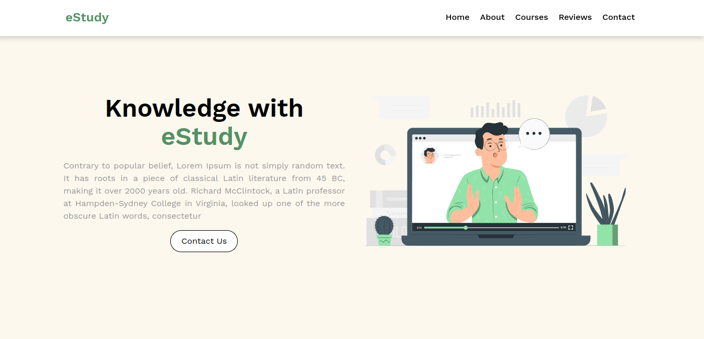

# eStudy



## Descrição

eStudy é uma aplicação web responsiva feita em React, Typescript e Tailwind.

## O que foi usado para o desenvolvimento ?
* Vite
* React
* Tailwind
* Typescript

## Instalação

```bash
npm install
```

```bash
npm run dev
```
